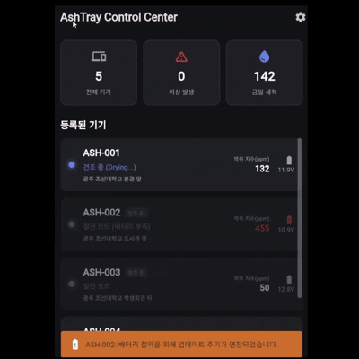
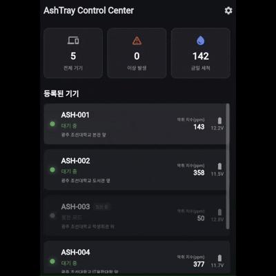
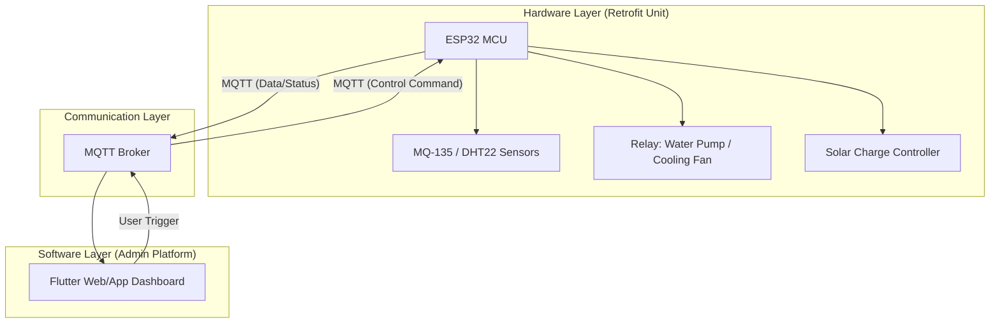

# 🚬 스마트 클린 애쉬트레이 (Smart Clean Ashtray)

> **노후 흡연 구역 재생을 위한 데이터 기반 지능형 위생 관리 시스템**
>
> **ESP32 기반 임베디드 환경 제어 및 Flutter 관리자 대시보드 통합 솔루션**

본 프로젝트는 공공장소 흡연 구역의 고질적인 문제인 악취와 화재 위험을 해결하기 위해 기획되었습니다. 내구성이 검증된 **기성 스테인리스 스탠드 재떨이**를 본체로 활용하고, 내부에 **IoT 제어 모듈 및 수조 시스템을 탑재**하는 **리트로핏(Retrofit)** 전략을 통해 경제성과 실용성을 동시에 확보한 지능형 인프라 솔루션입니다.

---
 

## 📺 Project Preview

| 📱 관리자 대시보드 (App) | ⚙️ 원격 시퀀스 제어 |
| :---: | :---: |
|  |  |

---
 

## 🚀 주요 기능 (Key Features)

### 1. 데이터 기반 능동형 모니터링
- **환경 데이터 수집**: $MQ-135$ (가스/악취) 및 $DHT22$ (온습도) 센서를 활용하여 흡연 구역 내 대기질 실시간 측정
- **실시간 시각화**: 수집된 데이터를 $10$초 주기로 전송하여 대시보드 내 그래프 및 수치로 시각화

### 2. 자율 및 원격 제어 시스템
- **자동 세척 시퀀스**: 가스 농도 또는 온도가 설정된 임계치($Threshold$)를 초과할 경우, 시스템 판단에 따라 자동 살수 및 건조 실행
- **원격 강제 제어**: 관리자 앱의 명령을 통해 즉각적인 살수($5$초) 및 건조($10$초) 인터페이스 제공

### 3. 에너지 자립 및 저전력 설계
- **태양광 리트로핏**: 상단 뚜껑부에 소형 태양광 패널을 장착하여 외부 전원 공사 없이 자가 발전 및 충전 수행
- **가변 주기 알고리즘**: 배터리 전압이 $11V$ 이하로 하락 시 데이터 전송 주기를 동적으로 조절하고 **Deep Sleep** 모드 강제 진입

### 4. 긴급 화재 대응
- **화재 전용 로직**: 온도 $60^\circ C$ 이상 감지 시 예외 처리 인터럽트 발생, 즉시 경고 알림 전송 및 자동 살수 모드 가동

---
 

## 🛠 Tech Stack

### Hardware Strategy

### Embedded & Hardware

### Mobile & Web

### Communication & Backend

### Design & Tools

---
 

## 🏗 시스템 아키텍처 (System Architecture)

---
 

## 🔗 관련 문서 (Documents)
- [Team Notion: 프로젝트 관리 및 회의록](여기에 노션 링크)
- [Jira Board: 업무 스케줄 및 이슈 관리](여기에 지라 링크 - 공개 가능한 경우)

---
 

## 🛠 협업 규칙 (Collaboration Rules)

### 📌 Git Commit Convention
팀원 간의 원활한 코드 리뷰와 히스토리 파악을 위해 아래의 커밋 메시지 규칙을 준수합니다.
- 메시지 형식: `태그: 작업 내용` (예: `feat: MQTT 실시간 데이터 전송 로직 구현`)

| 태그 | 설명 |
| :--- | :--- |
| **feat** | 새로운 기능 추가 |
| **fix** | 버그 수정 |
| **design** | UI 디자인 수정 및 3D 모델링(STL) 작업 |
| **docs** | 문서 수정 (README, PRD, SRS, PPT 등) |
| **refactor** | 코드 리팩토링 (기능 변경 없는 코드 구조 개선) |
| **chore** | 빌드 업무, 패키지 매니저 설정, .gitignore 수정 등 |
| **test** | 테스트 코드 추가 및 리팩토링 |

### 🌿 Branch Strategy
- **main**: 제품 출고 및 최종 발표용 브랜치 (가장 안정적인 버전)
- **develop**: 다음 출시 버전을 위한 개발 통합 브랜치
- **feature/기능명**: 각 파트별 세부 기능 개발 브랜치

### 🤝 Code Review & Merge
- 모든 기능 개발은 `feature/` 브랜치에서 진행합니다.
- 개발 완료 후 `develop` 브랜치로 **Pull Request(PR)**를 생성합니다.
- 최소 **2명 이상의 팀원 승인(Approve)**을 득한 후 Merge하는 것을 원칙으로 합니다.

